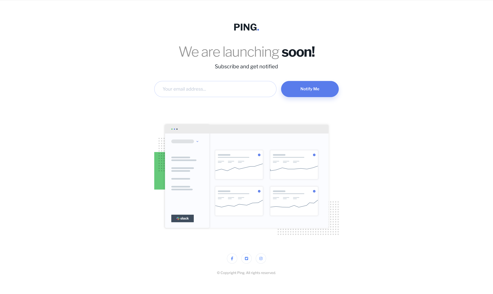

# Ping Coming Soon Page

A responsive coming-soon landing page based on the [Frontend Mentor Ping challenge](https://www.frontendmentor.io/challenges/ping-single-column-coming-soon-page-5cadd051fec04111f7b848da). It presents the Ping brand, a launch announcement, an email subscription form, a dashboard preview, and social links.

## Result



## Run locally

Open `index.html` directly in a browser, or serve this folder with any static web server. The Libre Franklin font is loaded from Google Fonts, so the custom font requires an internet connection; a sans-serif fallback is included.

## Code structure

### `index.html`

The HTML contains the page structure and content:

1. **Document head** — sets the page title, responsive viewport, description, favicon, Google Font, and stylesheet.
2. **Announcement (`main.announcement`)** — holds the Ping logo, launch heading, subscription prompt, email form, and dashboard illustration.
3. **Subscription form (`form.subscribe-form`)** — contains a screen-reader-only label, email input, feedback message, and submit button. JavaScript validates the email and announces helpful messages accessibly.
4. **Footer (`footer.site-footer`)** — contains accessible social links using the local Facebook, Twitter, and Instagram SVG files, plus the copyright line.

### `style.css`

The stylesheet is organized around the page's visual design:

- CSS custom properties define the challenge's blue, pale blue, gray, and dark-blue palette.
- Base styles set typography, box sizing, and page spacing.
- Flexbox centers the page content and lays out the desktop subscription form.
- The mobile media query stacks the form controls and adjusts spacing and type sizes for narrow screens.
- Hover and keyboard-focus styles give the button and social links visible interactive states.
- A reduced-motion media query limits transitions for visitors who prefer less motion.

### `script.js`

The form script trims whitespace, reports the challenge's required error messages for an empty or malformed email, focuses the field after an error, and clears the message as the user edits. Valid email input receives an honest status message because there is no mailing-list service connected to this static page.

### Project files

```text
ping coming soon page/
├── index.html
├── style.css
├── script.js
├── README.md
├── README-template.md
├── style-guide.md
├── preview.jpg
├── design/
│   ├── desktop-design.jpg
│   ├── desktop-hover-error-states.jpg
│   ├── mobile-design.jpg
│   └── mobile-error-state.jpg
└── images/
    ├── logo.svg
    ├── illustration-dashboard.png
    ├── favicon-32x32.png
    ├── facebook-f-brands-solid-full.svg
    ├── square-twitter-brands-solid-full.svg
    ├── instagram-brands-solid-full.svg
    └── result.png
```

The `design/` folder contains the supplied visual references. The `images/` folder contains the page artwork, social icons, favicon, and the rendered result screenshot.

## Form behavior

The form checks for an email address and displays the challenge's messages for an empty field or an incorrectly formatted address. It is a front-end demo: it does not send or store subscriptions because no mailing-list service is connected.

## Built with

- Semantic HTML
- CSS custom properties
- Flexbox
- Responsive media queries
- JavaScript form validation
- Accessible labels and focus states
